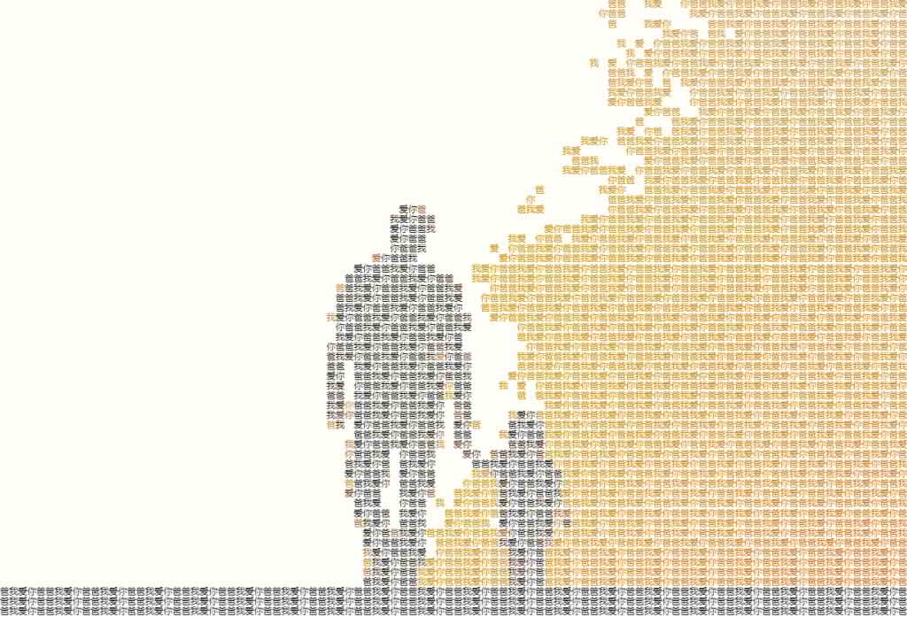
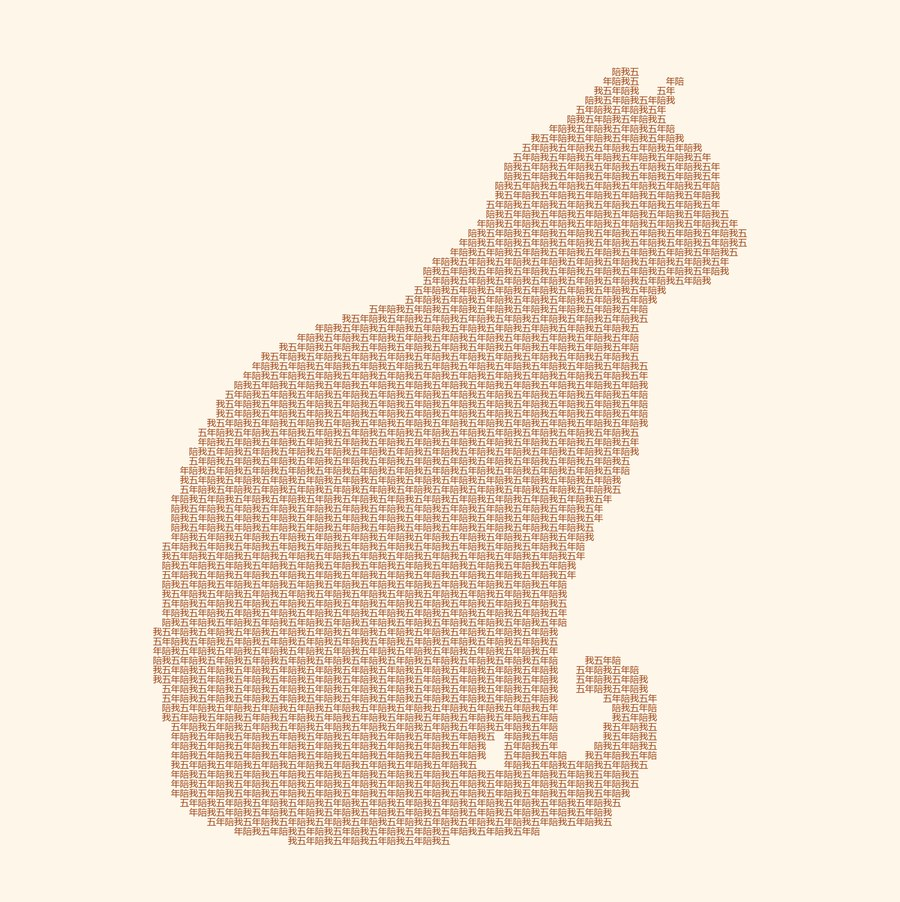
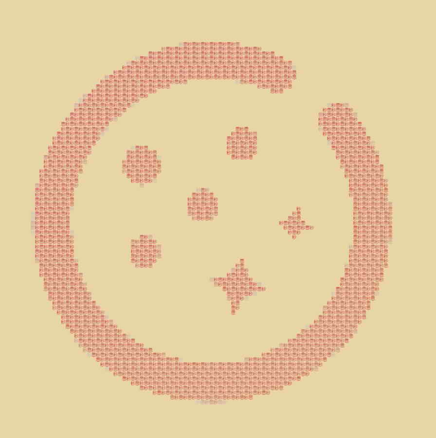
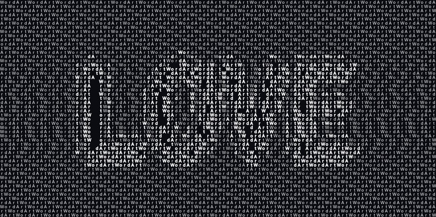

# WordArt 文字画

> 用你想说的话,拼出你爱的图。

一张图决定画面长什么样,一句话决定画面由什么组成。上传照片、输入短语,得到一幅由这句话平铺而成的字符画:远看是原图,凑近全是字。黑白版打印下来手工描红,彩色版直接装裱,导出 A4 PDF,就是一份能送出去的礼物。

**在线使用:[muse-wordart.pages.dev](https://muse-wordart.pages.dev)** · 无需注册,打开即用,图片全程不离开你的设备。

## 案例效果

| 送恋人 | 送爸爸 |
|---|---|
|  |  |
| 「某某我爱你」· 一切从这里开始 | 「爸爸我爱你」· 你想哪里去了 |

| 送自己 | 送公司 |
|---|---|
|  |  |
| 「陪我五年」· 礼物非要送人吗 | 「秒思」木色 · 打印即可当雕刻稿 |

| 送同事 | 暗底风格 |
|---|---|
|  |  |
| 「小鲶鱼」· 下一张就是你的 | 「WordArt」· 最后一张,送它自己 |

## 三步成礼

1. **选一张照片**:合影、头像、Logo,什么都行;支持点击上传、拖拽、Ctrl+V 粘贴截图
2. **写一句想说的话**:这句话会平铺成整幅画,空格是留白
3. **打印装裱送出**:A4 PDF 直出,300 DPI,3 米外仍认得出原图

参数拿不准就用预设:照片标准 / 白底卡通 · Logo / 暗底 · 夜景,一键切换。所有滑块实时生效,拖动即见效果。

## 界面:电脑手机都顺手

电脑上,「三步成礼」下方是通栏的创作输入区——照片、一句话、裁剪都在这里;再往下左「微调」右「成品」,参数一动预览即变。手机上同一套分区:输入通栏置顶,下方左右双栏同屏,调参的每一刻结果都在眼前,不用上下翻页。配图主体太小?图片框右上角的「裁剪」随手一裁,原图始终保留、可反复重裁。

## 隐私:零上传

这个网站**没有后端服务器**。所有图片处理在浏览器本地 Canvas 完成,网络面板从头到尾零上传请求——传合影也放心。断网时 `dist/` 双击 `index.html` 同样能用。

仓库里的 `backend/` 是开发期批量生成案例图的 Python 离线脚本,不是网络服务,线上产品只有纯静态前端。

## 它是怎么工作的

渲染管线共五步,前后端两套引擎口径一致,同一组参数复现同一效果:

1. **亮度采样**:图片按 BT.601 加权亮度切成 cols × rows 的格子矩阵
2. **阈值掩码**:亮度低于阈值的格子落字,形成画面的"暗部"
3. **边缘加粗**:明暗交界的格子强制落字并描边,保住轮廓——这是"3 米外认得出原图"的关键
4. **短语平铺**:从短语逐字取字填格,空格保留为呼吸位;行高按 CJK 方块字加 8% 余量
5. **矢量导出**:导出时格子矩阵不变、字号等比放大,因此 2x 高清不发糊

调参经验:白底卡通 / Logo 类阈值取 175–215;暗底亮图开"反转"加"加粗边缘";整体发灰先把对比度拉到 1.3。

## 本地运行

### 前端(浏览器应用)

```bash
cd frontend
npm install
npm run dev        # 开发: http://localhost:5173
npm run build      # 产出 dist/ 纯静态站点
```

`dist/` 因相对路径配置,可直接托管到 Cloudflare Pages / 任意静态目录,断网双击 `index.html` 也能用。字体自托管(思源宋体 + 霞鹜文楷),访客设备无需预装字体,部署后观感一致。

### 后端(Python 离线管线,批量出图用)

```bash
pip install -r backend/requirements.txt

# 文字画核心:一次出齐 PNG + 2x + PDF
python backend/generate.py --image backend/assets/demo/miaosilogo.jpg --text "秒思" --threshold 215

# 纯文本管线:TXT 可复制誊抄
python backend/generate.py --image photo.jpg --text "某某我爱你" --mode ascii

# 姓名拼图:wordcloud,支持 "名字:权重" 写法与形状蒙版
python backend/generate.py --mode cloud --words "张三,李四:3,王五" \
    --image mascot.png --mask mascot.png

python backend/batch.py    # 按 cases.json 批量生成
```

## 常用参数

| 参数 | 作用 | 怎么调 |
|---|---|---|
| 自定义短语 | 平铺进画面的文字 | 空格是留白,善用它控制疏密 |
| 输出宽度(列数) | 画面精细度 | 越大越逼真,渲染也越慢 |
| 亮度阈值 | 哪些格子落字 | 白底图调高(175–215),暗底图配反转 |
| 反转前景/背景 | 交换明暗判定 | 暗底亮图必开 |
| 加粗边缘 | 描边明暗交界 | 想要轮廓清晰就开 |
| 渲染模式 | 单色 / 原色 | 送礼打印建议单色 |
| 对比度 / 亮度 | 预处理 | 整体发灰先拉对比度 1.3 |

## 仓库结构

```
WordArt/
├── AGENTS.md              # 仓库导航:架构、命令、参数映射、踩坑记录
├── HANDOVER.md            # 开发交接:背景、已锁定决策、验收标准
├── spec.md                # 功能规格:F1-F9 分级、非功能需求
├── intent.md              # 立项动机:用户场景
├── plan.md                # 开发时表与展示脚本
├── backend/               # Python 离线渲染管线(非服务)
│   ├── wordart/           #   渲染库六模块
│   ├── generate.py        #   单图 CLI(text / ascii / cloud)
│   ├── batch.py           #   批量生成
│   └── assets/demo/       #   输入图与自测素材
└── frontend/              # 浏览器应用(Vite 5 + 原生 JS + Canvas)
    ├── src/               #   engine.js 渲染引擎 / main.js 交互 / exporter.js 导出
    └── public/            #   示例图、案例图、自托管字体
```

深入阅读入口:改渲染逻辑前读 `AGENTS.md` 的"双引擎架构"与"参数对应表";想了解项目为什么长这样,读 `intent.md`;前端细节见 `frontend/README.md`。

## 致谢

参数面板设计对标 [charart.odin-lab.com](https://charart.odin-lab.com),产品灵感来自词云(word cloud)——词云按词频摆位置,WordArt 按明暗铺文字:用内容承载情感,用亮度承载画面。
